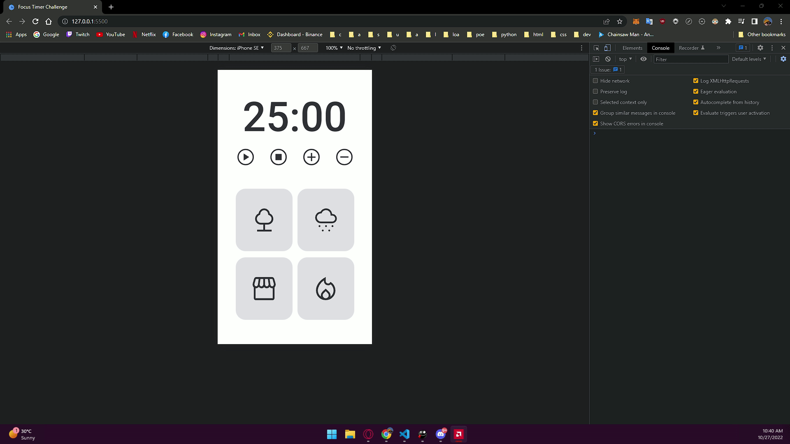

<h1 align="center"> Focus Timer Pomodoro Challenge </h1>

  <a href="#-tecnologias">Tecnologias</a>&nbsp;&nbsp;&nbsp;|&nbsp;&nbsp;&nbsp;
  <a href="#-projeto">Projeto</a>&nbsp;&nbsp;&nbsp;&nbsp;&nbsp;&nbsp;</a>

 

<h2 align="center"> Focus Timer Pomodoro Challenge 01 </h2>

  

<h2 align="center"> Focus Timer Pomodoro Challenge 02 (Dark Mode & Volume)</h2>

  

## 🚀 Tecnologias

Esse projeto foi desenvolvido com as seguintes tecnologias:

- HTML e CSS
- JavaScript(ES6), modules. injections, factory's
- DOM

## 💻 Projeto

O primeiro desafio era criar esse [design](https://efficient-sloth-d85.notion.site/FocusTimer-Vers-o-2-0-2e273fa9212a432eae6b51dda3c69594) e praticar o que aprendemos sobre novos conceitos de JavaScript. O segundo desafio [challenge 02](https://efficient-sloth-d85.notion.site/FocusTimer-Dark-Mode-df7a74c5bcb745a0be5428897eb79b3e) era adicionar Dark Mode e Volume.

---

Feito com ♥ by Gustavo Batista :wave: [LinkedIn](https://www.linkedin.com/in/gustavo-h-batista/) e [GitHub](https://github.com/gustavohdab)